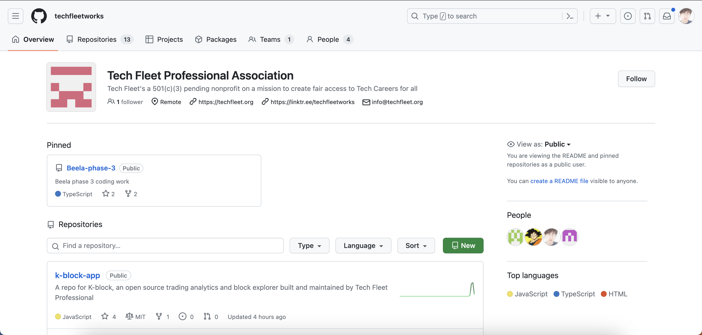
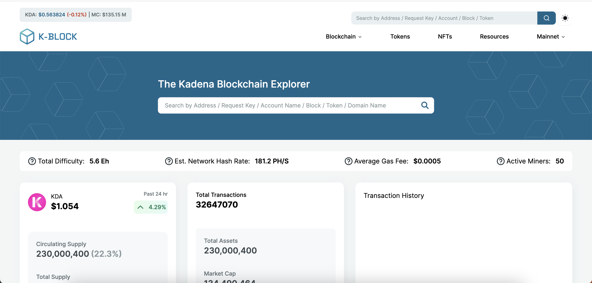

<h1 style="padding-left: 250px;">John Jang</h1>
<table>
<tr>
<th style="text-align: center; color: blue;">
The Designer
</th>
<th style="text-align: center; color: green;">
The Developer
</th>
</tr>
<tr>
<td>

</td>
<td>

</td>
</tr>
</table>
<br/>
<p>
My name is John Jang.<br/>
I am a UX Designer and a software developer who resides in Canada and  who is passionate in a) listening to the voices, b) discover the problems that are out there in the digital world, and c) bring out solutions by iterating the ideas from scratch to the production.
</p>

<section>

<h1 style="padding-left: 230px;">My Tech Stack</h1>
<h2 style="padding-left: 270px"> Languages </h2>
<div style="padding-left: 200px; display: flex;">
<div>
<p style="padding-left: 30px;">Learned</p>

</div>
<div style="padding-left: 20px;">
<p>Learning in Progress</p>

</div>
</div>

<h2 style="padding-left: 160px;"> Language Libraries & Frameworks </h2>
<div style="padding-left: 140px; display: flex;">
<div>
<p style="padding-left: 35px;">React</p>

</div>
<div style="padding-left: 20px;">
<p style="padding-left: 20px;">React Query</p>

</div>
<div style="padding-left: 20px;">
<p style="padding-left: 35px;">JQuery</p>

</div>
</div>
<div style="padding-top: 5px; padding-left: 250px">
<p>Learning in Progress</p>
<p style="padding-left: 45px;">Next.js</p>

</div>

<h2 style="padding-left: 230px;"> CSS (UI) Libraries </h2>
<div style="padding-left: 80px; display: flex;">
<div>
<p style="padding-left: 30px;">CSS 3</p>

</div>
<div style="padding-left: 20px;">
<p style="padding-left: 20px;">Tailwind CSS</p>

</div>
<div style="padding-left: 20px;">
<p style="padding-left: 22px;">Shadcn UI</p>

</div>
<div style="padding-left: 20px">
<p style="padding-left: 30px;">Radix UI</p>

</div>
</div>

<h2 style="padding-left: 235px;"> CSS Framework </h2>
<div style="margin-left: 270px">
<p style="margin-left: 20px">Bootstrap</p>

</div>

<h2 style="padding-left: 240px;"> Version Control </h2>
<div style="padding-left: 220px; display: flex;">
<div>
<p style="padding-left: 40px;">Git</p>

</div>
<div style="padding-left: 20px;">
<p style="padding-left: 35px;">Github</p>

</div>
</div>

<h2 style="padding-left: 255px;"> Deployment </h2>
<div style="margin-left: 260px">
<div>
<p style="margin-left: 30px">
Vercel
</p>

</div>
</section>
<br/>
<section>
<h1>Volunteer</h1>
<div>
<p>I am currently volunteering as an apprence developer at...<p>
[Tech Fleet Professional Assocation](https://techfleet.org)

</div>
<div style="display: flex">
<p>Project name:</p>
<p style="color: blue; margin-left: 5px">K-Block Phase 3</p>
</div>

</section>
<br/>
<section>
<h1>My Portfolio</h1>
You can check out my portfolio [here](https://johnjang94.github.io/portfolio/)
<br/><br/>

```js
function myHobbies() {
    const music = [
        type1: 'kpop',
        type2: 'rap',
        type3: 'hiphop',
    ]

    const sports = [
        type1: 'dance',
        type2: 'rock-climbing',
        type3: 'cycling',
        type4: 'soccer',
        type5: 'canoeing',
        type6: 'swimming',
    ]

    const reading = [
        book1: 'Life & Work Principles by Ray Dalio',
        book2: 'Money, Master The Game by Tony Robbins',
        book3: 'Inside JavaScript by (author undefined)',
        book4: 'Surviving from Inflation by Mr. Oh',
    ]

}
```

</section>
<section>
<h1>My Interests</h1>

```js
function designWorks() {
    const tools = [
        tool1: 'Figma',
        tool2: 'Adobe XD',
    ]
}

function codingWorld() {
    const coding = [
        language1: 'JavaScript',
        language2: 'TypeScript',
        library: 'React.js',
        framework: 'Next.js',
        backend: 'Node.js',
    ]
}

function moneyMatters() {
    const investment = [
        type1: 'bio-technology',
        type2: 'AI',
        type3: 'real-estate',
        type4: 'e-commerce',
    ]
}
```

<section>
<h2>Let's connect!</h2>
[LinkedIn](www.linkedin.com/in/johnjang94)
<footer>
<p>That is pretty much all about me!!! Please be in-touch with me and thanks for coming-by!</p>
</footer>
</section>
